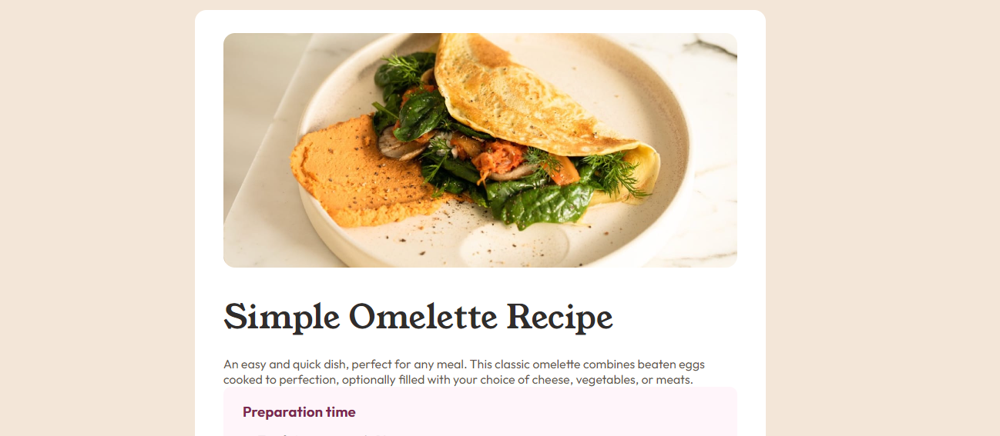
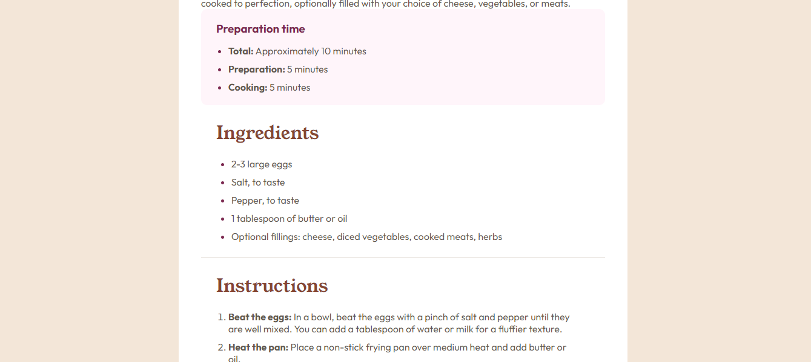
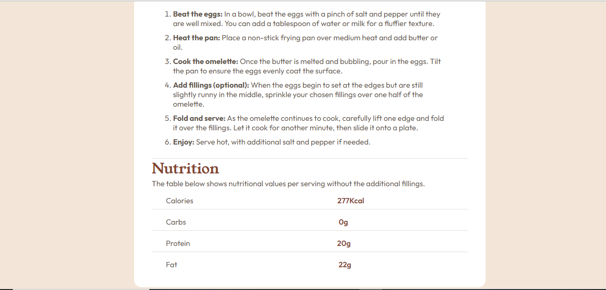

# Frontend Mentor - Recipe page solution

This is a solution to the [Recipe page challenge on Frontend Mentor](https://www.frontendmentor.io/challenges/recipe-page-KiTsR8QQKm). Frontend Mentor challenges help you improve your coding skills by building realistic projects. 

## Table of contents

- [Overview](#overview)
  - [The challenge](#the-challenge)
  - [Links](#links)
- [My process](#my-process)
  - [Built with](#built-with)
  - [What I learned](#what-i-learned)
  - [Continued development](#continued-development)
  - [Useful resources](#useful-resources)
- [Author](#author)
- [Acknowledgments](#acknowledgments)

**Note: Delete this note and update the table of contents based on what sections you keep.**

## Overview

### Screenshot






### Links

- Solution URL: [Add solution URL here](https://your-solution-url.com)
- Live Site URL: [Add live site URL here](https://your-live-site-url.com)

### Built with

- Semantic HTML5 markup
- CSS custom properties
- Flexbox
- Mobile-first workflow


### What I learned

I learnt how to change the color of the list type(the Bullets and Numbers) of Unodered and Ordered list tag

To see how you can add code snippets, see below:

```Unodered List
<ul>
  <li>
    <span>2-3 large eggs</span>
  </li>
  <li>
    <span>Salt, to taste</span>
  </li>
  <li>
    <span>Pepper, to taste</span>
  </li>
  <li>
    <span>1 tablespoon of butter or oil</span>
  </li>
  <li>
    <span>Optional fillings: cheese, diced vegetables, cooked meats, herbs</span>
  </li>
</ul>
```
```css
.ingredientsContainer ul{
    display: flex;
    justify-content: center;
    align-items: start;
    flex-direction: column;
    flex-wrap: wrap;
    gap: 10px;
    font-size: 16px;
    color: hsl(332, 51%, 32%);
    margin: 0 0 0 25px;

}

.ingredientsContainer ul li > span{
    color: hsl(30, 10%, 34%);
}
```
Odered List
```html

<ol>
  <li>
    <span class="instructionsHeading">Beat the eggs:</span>  In a bowl, beat the eggs with a pinch of salt and pepper until they are well mixed.
    You can add a tablespoon of water or milk for a fluffier texture.
  </li>
  <li>
    <span class="instructionsHeading">Heat the pan:</span>  Place a non-stick frying pan over medium heat and add butter or oil.
  </li>
  <li>
    <span class="instructionsHeading">Cook the omelette:</span>  Once the butter is melted and bubbling, pour in the eggs. Tilt the pan to ensure
    the eggs evenly coat the surface.
  </li>
  <li>
    <span class="instructionsHeading">Add fillings (optional):</span>  When the eggs begin to set at the edges but are still slightly runny in the
    middle, sprinkle your chosen fillings over one half of the omelette.
  </li>
  <li>
    <span class="instructionsHeading">Fold and serve:</span> As the omelette continues to cook, carefully lift one edge and fold it over the
    fillings. Let it cook for another minute, then slide it onto a plate.
  </li>
  <li>
    <span class="instructionsHeading">Enjoy:</span>  Serve hot, with additional salt and pepper if needed.
  </li>
</ol>
```
```css
.instructionContainer ol{
    display: flex;
    justify-content: center;
    align-items: start;
    flex-direction: column;
    flex-wrap: wrap;
    gap: 10px;
    padding: 0 20px;
    font-size: 16px;
    color: hsl(30, 10%, 34%);
}

.instructionsHeading{
    font-weight: 700;
}


.nutrtionFactsContainer{
    color: hsl(30, 10%, 34%);
    font-weight: 400;
}
```


### Useful resources

- (https://www.geeksforgeeks.org/) - This is an amazing article which helped me finally understand how to change colors of List tags. I'd recommend it to anyone still learning this concept.


## Author

- Website - [Add your name here](https://www.your-site.com)
- Frontend Mentor - [@yourusername](https://www.frontendmentor.io/profile/yourusername)
- Twitter - [@yourusername](https://www.twitter.com/yourusername)


## Acknowledgments